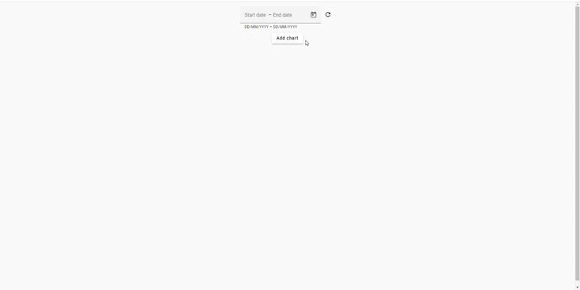
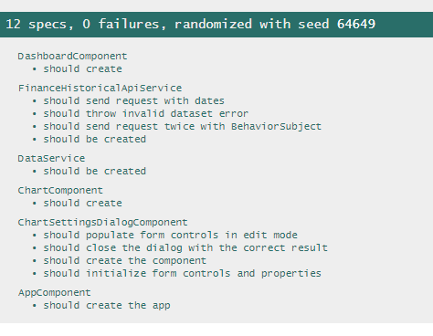

# ChartDashboard

## Task Description

Please create a single page web application using Angular/Material/Tailwind/rxjs.

The application should be a simple chart widgets dashboard. On a dashboard user can put 1 to 4 charts. Optional: Make charts as directive.On the top bar it should be possible to set a date period that will be applied to all charts at the same time.

Every chart should be configurable:

-type: line or bar chart-selection of sensors

-color of lines 

For data shown in charts generate random values or use some public data API (optional).

Example: There are N sensors, some of them measure temperature, some -humidity, some -light. We need to show that data on different charts. Sometimes we can combine temperature from 2 sensors and humidity and all in 1 chart.

Other libraries that could be used:

-angular ui bootstrap or analogue

-angular ui router or analogue-highcharts or analogue

## Development server

#### To start this project, add your api key for [financialmodelingprep.com](https://site.financialmodelingprep.com/developer/docs) to the [environment.ts](src%2Fenvironments%2Fenvironment.ts) file.

Run `ng serve` for a dev server. Navigate to `http://localhost:4200/`. The application will automatically reload if you change any of the source files.

## Running unit tests

Run `ng test` to execute the unit tests via [Karma](https://karma-runner.github.io).

